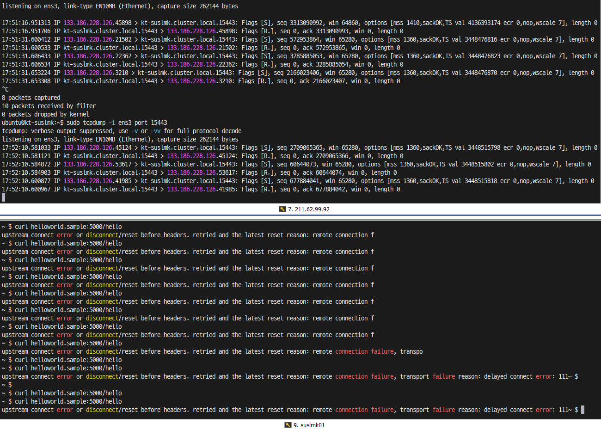

## 테스트1

### MetalLB PrivateIP Routing
- 마지막 curl 명령어 수행시 성공까지 약 2~3분의 시간이 걸렸다.
```
ubuntu@suslmk01:~$ kubectl get node --context=ctx-1
NAME       STATUS     ROLES           AGE   VERSION
suslmk01   Ready      control-plane   80m   v1.26.5
suslmk02   NotReady   <none>          79m   v1.26.5
ubuntu@suslmk01:~$ kubectl get node --context=ctx-2
NAME        STATUS   ROLES           AGE   VERSION
suslmk-01   Ready    control-plane   74m   v1.26.5
```

- ctx-2(naver)에 PREROUTING 생성
```
ncloud@suslmk-01:~$ sudo iptables -t nat -I PREROUTING -p tcp -d 192.168.0.120 -j DNAT --to-destination 133.186.211.27^C
ncloud@suslmk-01:~$ sudo iptables -nL PREROUTING -t nat --line-numbers
Chain PREROUTING (policy ACCEPT)
num  target     prot opt source               destination
1    cali-PREROUTING  all  --  0.0.0.0/0            0.0.0.0/0            /* cali:6gwbT8clXdHdC1b1 */
2    DNAT       tcp  --  0.0.0.0/0            192.168.0.120        to:133.186.211.27
3    KUBE-SERVICES  all  --  0.0.0.0/0            0.0.0.0/0            /* kubernetes service portals */
```




```
ubuntu@suslmk01:~$ kubectl get svc -n istio-system --context=ctx-1
NAME                   TYPE           CLUSTER-IP      EXTERNAL-IP     PORT(S)                                                                                                      AGE
istio-ingressgateway   LoadBalancer   10.233.13.204   192.168.0.120   15021:30484/TCP,80:31715/TCP,443:30050/TCP,31400:31026/TCP,15443:31195/TCP,15012:31315/TCP,15017:32386/TCP   28m
istiod                 ClusterIP      10.233.33.105   <none>          15010/TCP,15012/TCP,443/TCP,15014/TCP                                                                        28m
ubuntu@suslmk01:~$ kubectl get svc -n istio-system --context=ctx-2
NAME                   TYPE           CLUSTER-IP     EXTERNAL-IP   PORT(S)                                                                                                      AGE
istio-ingressgateway   LoadBalancer   10.233.3.37    172.20.0.16   15021:32541/TCP,80:31940/TCP,443:30561/TCP,31400:30110/TCP,15443:30319/TCP,15012:30551/TCP,15017:32168/TCP   27m
istiod                 ClusterIP      10.233.31.85   <none>        15010/TCP,15012/TCP,443/TCP,15014/TCP                                                                        28m                                                                    26m

```

```
ncloud@suslmk-01:~$ kubectl exec -it sleep-8646df57b8-2c87q -n sample sh
kubectl exec [POD] [COMMAND] is DEPRECATED and will be removed in a future version. Use kubectl exec [POD] -- [COMMAND] instead.
~ $ curl helloworld.sample:5000/hello
Hello version: v2, instance: helloworld-v2-7bd9f44595-8vs9x
~ $ curl helloworld.sample:5000/hello
Hello version: v2, instance: helloworld-v2-7bd9f44595-8vs9x
```

```
ubuntu@suslmk01:~$ sudo tcpdump -i eth1 host 192.168.0.120
tcpdump: verbose output suppressed, use -v or -vv for full protocol decode
listening on eth1, link-type EN10MB (Ethernet), capture size 262144 bytes
18:50:03.412583 IP istio-ingressgateway.istio-system.svc.cluster.local.42436 > suslmk02.cluster.local.7946: Flags [S], seq 3949605540, win 64240, options [mss 1460,sackOK,TS val 1805765371 ecr 0,nop,wscale 7], length 0
18:50:05.468446 IP 223.130.173.122.44735 > istio-ingressgateway.istio-system.svc.cluster.local.15443: Flags [P.], seq 2435235850:2435237076, ack 1345706067, win 443, options [nop,nop,TS val 1510903839 ecr 1781273293], length 1226
18:50:05.468713 IP istio-ingressgateway.istio-system.svc.cluster.local.15443 > 223.130.173.122.44735: Flags [.], ack 1226, win 502, options [nop,nop,TS val 1781663153 ecr 1510903839], length 0
18:50:05.582915 IP istio-ingressgateway.istio-system.svc.cluster.local.15443 > 223.130.173.122.44735: Flags [P.], seq 1:1126, ack 1226, win 502, options [nop,nop,TS val 1781663267 ecr 1510903839], length 1125
18:50:05.585737 IP 223.130.173.122.44735 > istio-ingressgateway.istio-system.svc.cluster.local.15443: Flags [.], ack 1126, win 443, options [nop,nop,TS val 1510903957 ecr 1781663267], length 0
18:50:06.170939 IP istio-ingressgateway.istio-system.svc.cluster.local.29394 > suslmk02.cluster.local.10250: Flags [S], seq 3416587241, win 65280, options [mss 1360,sackOK,TS val 1597943000 ecr 0,nop,wscale 7], length 0
```